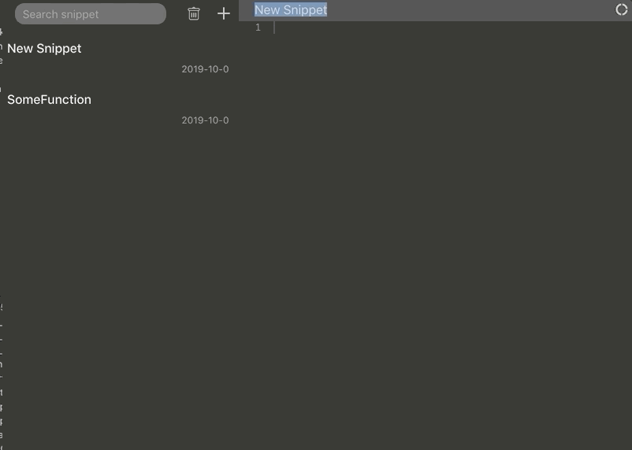

# SnipIt

#### SnipIt let's you save Snippets locally.

### Development

#### Install packages

`npm run install:all`

#### Run Dev. server

`npm run start:dev`

*It will(should) run both electron and react application*

### Build

`npm run dist`

*It will create build for mac* 

### License

#### MIT